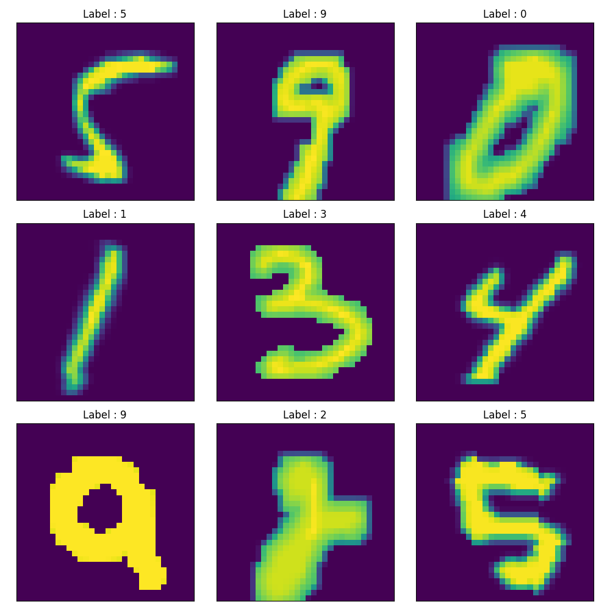
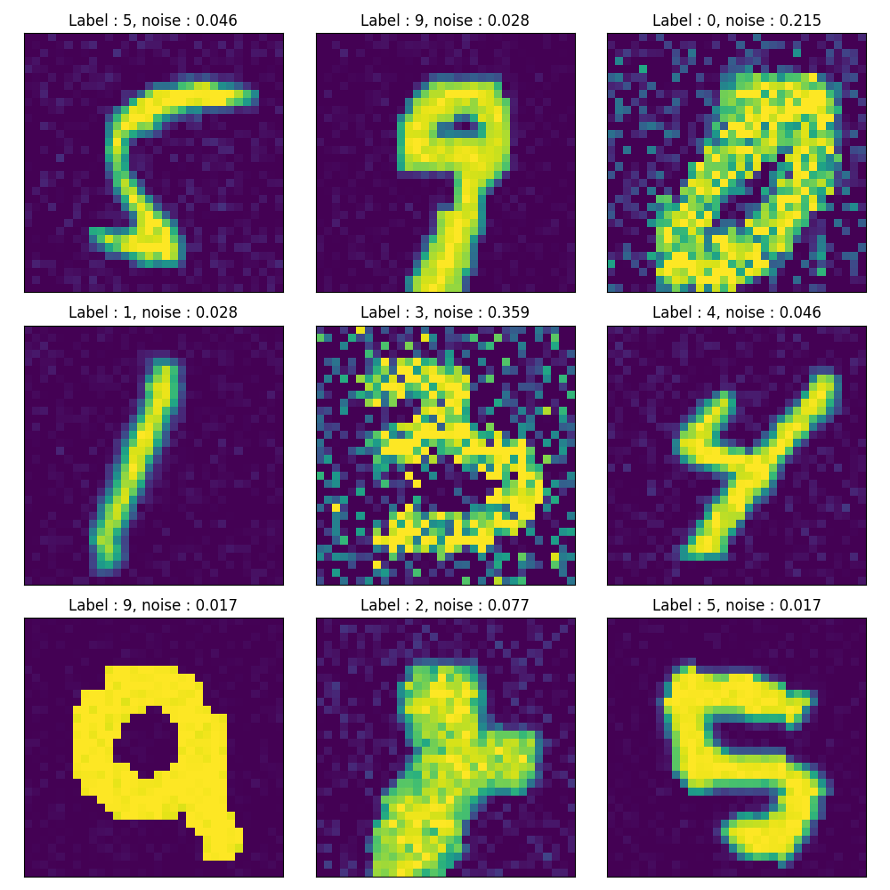

## Noise Conditional Score Network

This is a baseline 'reproduction' of the work [Generative Modeling by Estimating Gradients of theData Distribution](https://arxiv.org/pdf/1907.05600.pdf) by Song et al.

Here I use the MNIST dataset with a modified UNET network. The UNET decoder uses `Conditional Instance Normalization ++` from the paper to decode based on the input noise. This is not added to the encoder due to technical reasons.

### Dataset

| No noise added | Noise added |
|:--------------:|:-----------:|
| |  |

### Samples generated by the trained diffusion model

